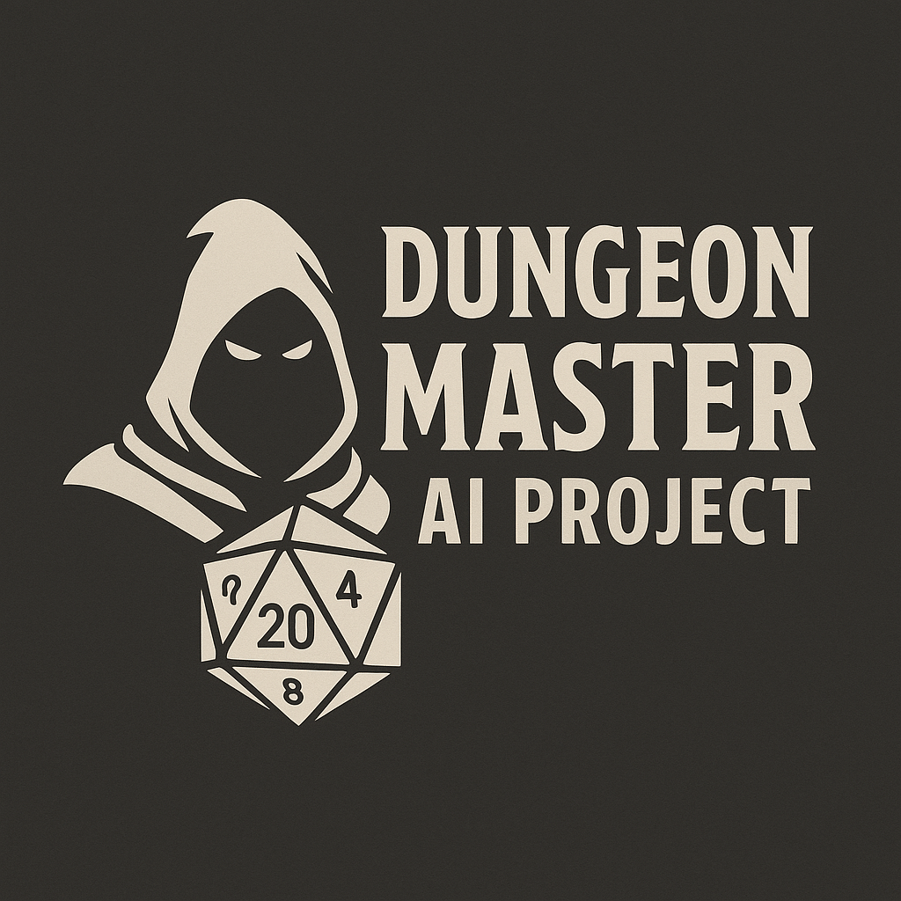

# 🧠 Dungeon Master AI – Python RPG Engine (Backend Only)





This repository contains the **backend core** of a modular role-playing game (RPG) engine built in **Python**, featuring a clean object-oriented architecture and a **stack-based finite state machine (FSM)**. The goal is to evolve into a GPT-powered, narrative-driven RPG system where an AI Dungeon Master enhances immersion through dynamic interactions.

---

## 🧱 Architecture Overview

Clear and scalable modular structure:

```
gioco_rpg/
├── main.py                     # Game entry point
├── core/                      # Game loop and I/O interface
├── entities/                  # Player, NPCs, enemies, shared logic
├── items/                     # Objects and interactive elements
├── states/                    # Game states (map, combat, inventory...)
├── util/                      # Dice rolling, utility functions
├── world/                     # Map system and environments
├── server.py                  # Flask server for web frontend (NEW)
```

Each phase of the game (exploration, dialogue, combat, inventory) is handled via a **stacked FSM**, allowing smooth transitions and layered states (e.g., opening a chest pushes a loot or dialog state on top of exploration).

---

## 🔧 Core Features

- **Modular and testable** architecture
- Full separation of **game logic and UI**
- **ASCII-based tile map** with movement controller
- **Stack-based FSM** for handling dynamic game states
- **EntityFactory** for generating dynamic content
- Full **serialization and deserialization** (player, states, map, NPCs)
- No Pygame dependency (backend only)
- Abstract **I/O interface** (`GameIO`, `TerminalIO`) for easy integration of GUI or AI

---

## 🚀 Recent Updates

- Added **Flask server** for future web interface (`server.py`)
- Full serialization implemented for:
  - Player, NPCs, interactive items
  - Positions and tile-based environments
  - Game states (inventory, dialogue, map, combat)
- Added `to_dict` / `from_dict` to almost all classes
- Robust handling of temporary states and missing data
- Enemies now calculate damage using `forza_base` modifiers
- Inventory and dialogue states now have structured phase handling

---

## 📅 Roadmap

⬜ Add modular I/O interfaces (GUI, AI)  
⬜ Implement **AI Dungeon Master** (GPT-based)  
⬜ Create web-based frontend (Flask + HTMX)

---

## 🌌 Future Vision – Dungeon Master AI

This backend will serve as the foundation for a GPT-enhanced RPG with:

- **AI Dungeon Master** reacting to player actions
- **Natural language command parsing**
- Mapping player choices to narrative events
- Web or terminal UI powered by abstracted `IOInterface`

---

## ▶️ Getting Started

```
git clone https://github.com/yourusername/gioco_rpg.git
cd gioco_rpg
python main.py
```

The game will launch in a text-based interface where you can explore, interact, fight, and talk to characters.

---

## 🧪 Requirements

- Python **3.10+**
- No external libraries required (uses only **standard library**)

---

## 🙌 Contribute

Looking for collaborators interested in:

- Web frontend (Flask + HTMX)
- GPT-based narrative engine
- Story and worldbuilding
- UI/UX feedback and playtesting

Feel free to open an issue, fork the repo, or contact me directly if you’d like to join the project!

---
